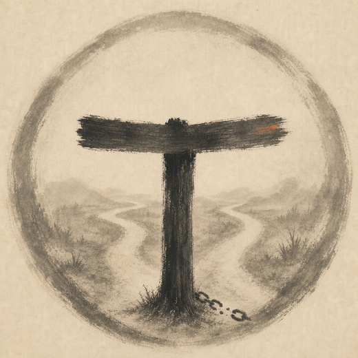

## Talha

backend developer building APIs, services, and database-backed systems.

- working on reliable backend services
- learning distributed systems and infrastructure
- interested in databases, queues, idempotency, and clean APIs
- using C#/.NET, Java/Spring, Go, PostgreSQL, Docker, and Linux
